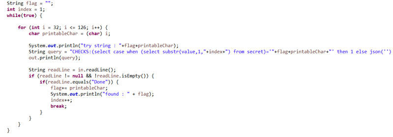
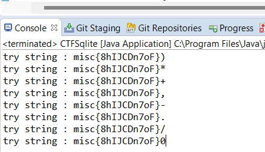

## ข้อ 2: Bespoke Library2

> 🏆 **Challenge**:   
> 💪 **Difficulty**:  🟠 MEDIUM  
> 🎯 **Category**: Web Application Security


โจทย์ข้อนี้ใช้ source file เดียวกับข้อที่แล้ว แต่ไม่สามารถใช้ **SQL Injection** ใน Method `queryBooks` และ `queryReviews` ได้อีก เนื่องจากโจทย์ปรับให้ secure ขึ้น

### การวิเคราะห์โจทย์  

เราเริ่มต้นการวิเคราะห์โดยไปดูที่ **ClientAppWithGUI Class** และพบฟังก์ชันที่น่าสนใจ คือ `CHECKS` ซึ่งถูกใช้ใน Method `displayBookRevies` เพื่อส่งค่า `id` ของหนังสือไปเช็คที่เซิร์ฟเวอร์ก่อนที่จะแสดงรายการ review ของหนังสือ  


---

### ขั้นตอนการทดสอบและแก้โจทย์  
เมื่อเราตรวจสอบแล้วว่า ยังมี function `CHECK` และส่งค่า `ID` ไปตรวจสอบตามที่แสดงใน Class **ClientAppWithGUI**, เราจึงเริ่มต้นทดสอบตามขั้นตอนต่างๆ:

#### 1. **การทดลองใช้ SQL Injection แบบ Union**  
   ใช้คำสั่ง:
   ```sql
   CHECKS:1 union select 1--
   ```
   **ผลลัพธ์:** เซิร์ฟเวอร์ตอบกลับด้วยข้อความว่า `DONE`

#### 2. **การทดลองส่งค่าอื่นๆ ที่แตกต่างกัน**  
   - ส่งค่า `CHECKS:1` ผลลัพธ์คือ `DONE`
   - ส่งค่า `CHECKS:w` ผลลัพธ์คือ ค่าว่าง
   - ส่งค่า `CHECKS:json('')` ผลลัพธ์คือ ค่าว่างอีกครั้ง

   **ผลลัพธ์:** พบว่าเซิร์ฟเวอร์สามารถตรวจสอบได้ว่า **ค่าที่ส่งเป็นตัวเลข** หรือ **ตัวอักษร** หรือ **เป็น JSON('')** จึงมีโอกาสที่จะให้เราใช้งาน **Error-Based SQL Injection** รวมทั้ง **Blind SQL Injection**

---

#### 3. **การตรวจสอบการมีอยู่ของ Table `secret` เผื่อโจทย์เปลี่ยนชื่อ table**  
   เพื่อหาว่ามี **table `secret`** หรือไม่ จะใช้ `CASE WHEN` ถ้ามี ให้ผลเป็น `1` ถ้าไม่มี ใช้ให้ Error ด้วยฟังก์ชัน `json('')` หรือ `load_extension(1)` ก็ได้
   
   ใช้คำสั่ง:
   ```sql
   CHECKS:(select case when (select count(*) from secret)='<input>' then 1 else json('') end)
   ```
   **ผลลัพธ์:** Server ตอบกลับเป็น `DONE` แสดงว่ามี Table `secret` ที่เราต้องการ

---

#### 4. **การใช้งาน Blind SQL Injection เพื่อดึง Flag**  
   หลังจากพบว่า **Table `secret`** มีข้อมูลในตัว และใช้ **Blind SQL Injection** หาตัวอักษรทีละตำแหน่ง 
   
   ใช้คำสั่ง:
   ```sql
   CHECKS:(select case when (select substr(value,1,"+index+") from secret)='<input>' then 1 else json('') end)
   ```
   โดยแทนค่า `index` เข้าไปในคำสั่งเพื่อทดสอบทีละตำแหน่งจนพบ Flag!  

---



   **ผลลัพธ์:** พบ **Flag** สำหรับโจทย์ข้อนี้!



### ✅ บทสรุปจากโจทย์นี้    
- การใช้งาน **Blind SQL Injection** ทำให้เราสามารถดึงข้อมูลออกจากระบบ แม้ว่าเซิร์ฟเวอร์จะไม่ตอบกลับข้อมูลตรงๆ
- **Error-Based SQL Injection** เป็นเครื่องมือที่ช่วยในการระบุตัวแปรหรือเงื่อนไขที่สามารถใช้เพื่อโจมตีได้
- ทั้งสองแบบช่วยให้เราเข้าใจวิธีการหลีกเลี่ยงการทำงานของระบบ โดยส่งคำสั่งแบบที่ไม่ได้แสดงผลกลับออกไปหรือที่เกิด Error

---
<a href="./"><<กลับหน้าหลัก</a>