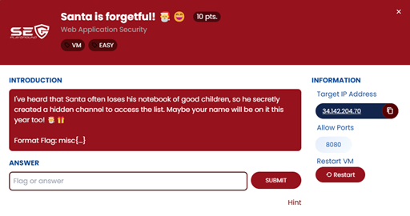
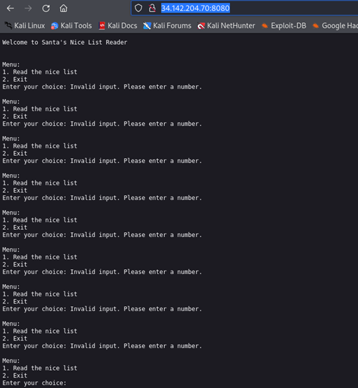
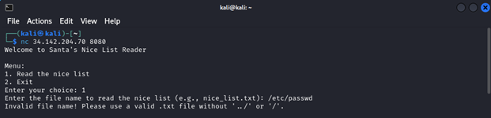
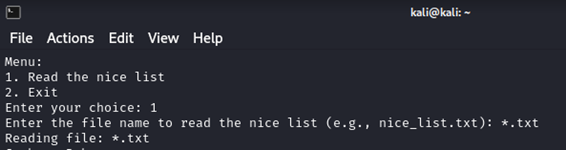
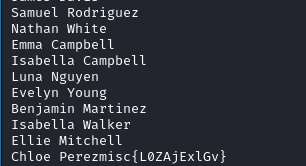

## ข้อ 4: Santa is forgetful!

> 🏆 **Challenge**:   
> 💪 **Difficulty**:  🟢 EASY  
> 🎯 **Category**: Web Application Security
 

## การวิเคราะห์โจทย์  
เมื่อเข้าสู่หน้า **page** จะเห็นว่ามีลักษณะการรับ input ตัวเลือกเมนู คล้ายกับ **program console** แต่พอจะใส่ input เข้าไปกลับไม่สามารถทำได้! น่าสงสัยใช่มั้ยล่ะ?  

## ขั้นตอนการทดสอบและแก้โจทย์    

- ด้วยเหตุนี้ เราจึงใช้วิธี **netcat (nc)** เชื่อมต่อไปยังเว็บ server เพื่อเข้าถึง **program console** แบบเต็มที่  
- เมื่อเชื่อมต่อแล้วลองเลือกเมนูที่ **1** (Read the nice list) พร้อมกับใส่ชื่อไฟล์เป็น `'/etc/passwd'` ผลคือ... เรากลับไม่สามารถอ่านไฟล์นั้นได้  

- เท่านั้นยังไม่พอ! ลองใหม่อีกรอบโดยใส่ชื่อไฟล์เป็น `*.txt` เนื่องจากข้อความบอกว่าอ่านได้เฉพาะไฟล์ txt เท่านั้น  

 

- โดนใจ! โปรแกรมกลับแสดงรายการไฟล์ที่มีชื่อไฟล์เป็น **flag** ซะงั้น   

### ✅ บทสรุปจากโจทย์นี้   
อย่างที่เห็น Santa is forgetful! อาจจะลืมไปบ้างว่ามีรายชื่อ **flag** ซ่อนอยู่ในไฟล์! การทดลองวิธีการต่าง ๆ ช่วยให้เราดึงข้อมูลที่ต้องการออกมาได้อย่างง่ายดาย   

---
###### #SECPlayground   #SECPlaygroundBloodyXMas2024 

<a href="./"><<กลับหน้าหลัก</a>