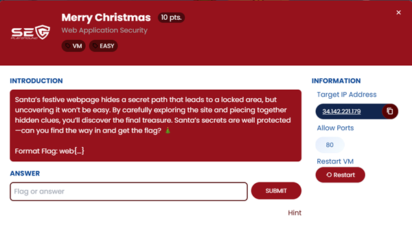
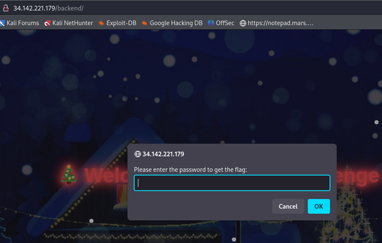
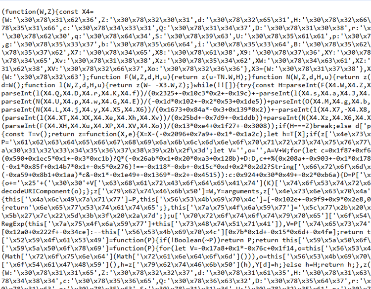
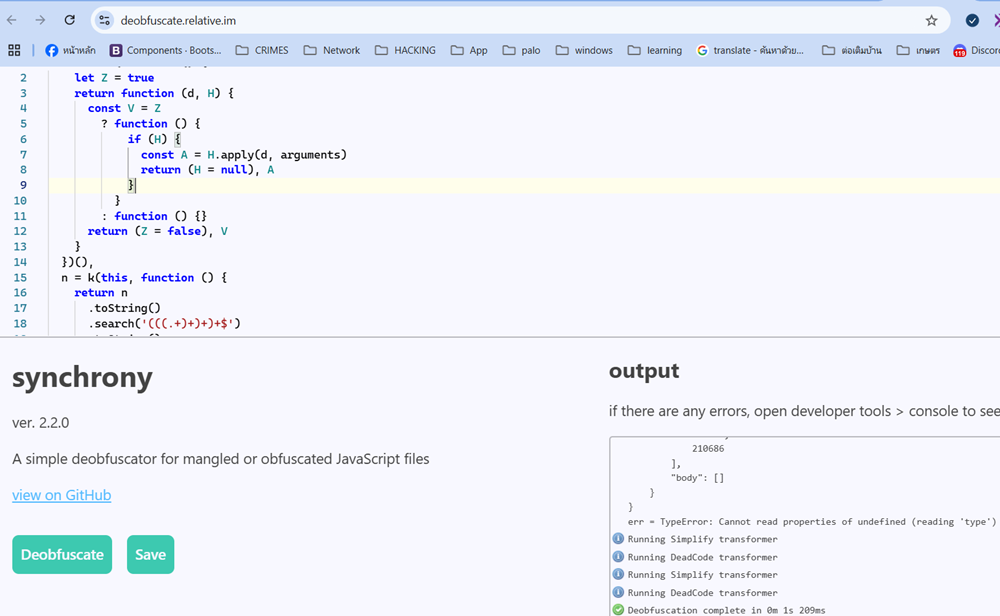
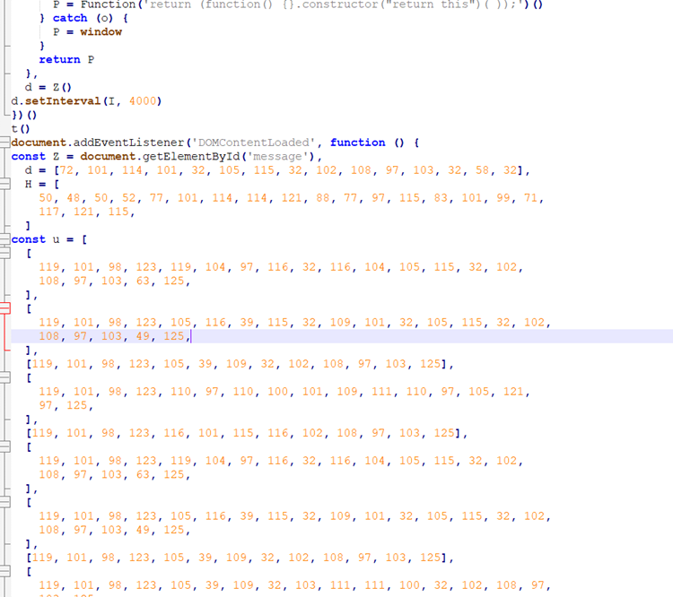
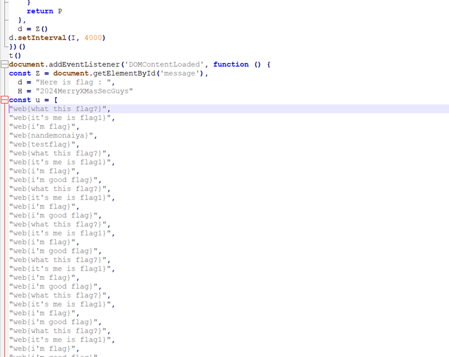
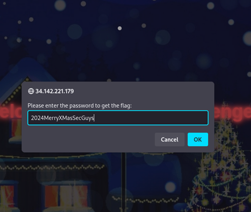
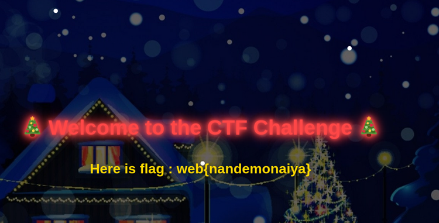

## ข้อ 5: Merry Christmas

> 🏆 **Challenge**:   
> 💪 **Difficulty**:  🟢 EASY  
> 🎯 **Category**: Web Application Security



## การวิเคราะห์โจทย์   

เมื่อเข้าสู่หน้าเว็บไซต์ครั้งแรก พบว่าเป็นหน้าเพจธรรมดา ไปหาที่อื่นกันดีกว่า

### การสำรวจข้อมูล 🕵️

#### Directory Enumeration
ใช้ `dirsearch` ในการค้นหา paths ที่น่าสนใจ:
```bash
dirsearch -u http://34.142.221.179/
```

พบไฟล์ที่น่าสนใจ: คือ **/backend/** ซึ่งดูเหมือนจะเป็นตำแหน่งที่มีข้อมูลที่เราต้องการ   


เมื่อเราลองเข้าไปที่หน้า **/backend** จะพบกับ **prompt** ให้เราใส่ **password** ซึ่งทำให้รู้ว่าเราต้องหาวิธีการเพื่อเข้าถึงข้อมูลภายในนั้น  



## 🔍 การวิเคราะห์ Source Code  
เริ่มสนุกกันแล้ว! เราลองเข้าไปดูที่ **source code** ของหน้าเว็บและพบกับไฟล์ **JavaScript** ชื่อว่า **app.js** แต่หลังจากดูแล้ว มันกลับถูก **obfuscate** ไว้ ทำให้เราไม่สามารถเข้าใจได้ง่าย ๆ   



ไม่ยอมแพ้ง่าย ๆ เราเลยลองนำโค้ดนี้ไป **deobfuscate** โดยใช้เว็บไซต์ [deobfuscate.relative.im](https://deobfuscate.relative.im/) เพื่อดูว่าสามารถแก้ไขได้หรือไม่   



ผลที่ได้คือ สามารถอ่านได้ง่ายขึ้น และมี **ค่าคงที่** ที่กำหนดไว้ปรากฏออกมา แต่พบว่าค่าของตัวแปรต่าง ๆ ยังอยู่ในรูปของ **array** ที่เป็น **ASCII code**   



### 🔑 การแปลงรหัส  
เราจึงนำ **ASCII codes** ที่ได้มา **แปลงรหัส** และพบว่าเรามี **key** ที่สามารถใช้ใส่ใน **prompt** นั้นได้ ก็คือ `2024MerryXMasSecGuys`   



รอช้าทำไมล่ะ! เอาไปใส่สิ



**ผลลัพธ์:** พบ **Flag** สำหรับโจทย์ข้อนี้!



### ✅ บทสรุปจากโจทย์นี้   
ด้วยการทดลองและการแปลงค่าที่ซ่อนอยู่ในไฟล์ **JavaScript** เราสามารถไขรหัสและค้นพบ **flag** ที่ซ่อนอยู่ได้ ซึ่งแน่นอนว่าความรู้และความพยายามนี้ช่วยให้เราผ่านด่านนี้มาได้อย่างสำเร็จ!  

---
<a href="./"><<กลับหน้าหลัก</a>