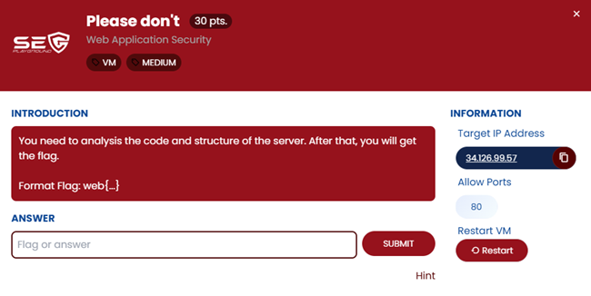
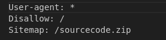
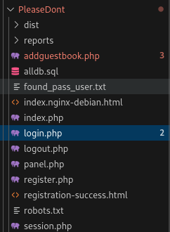
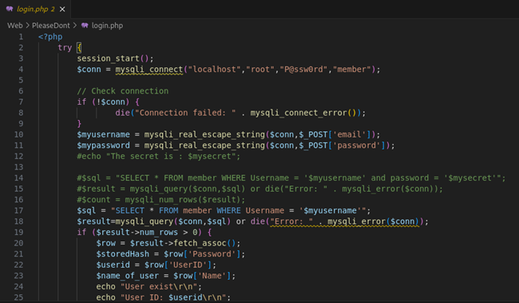
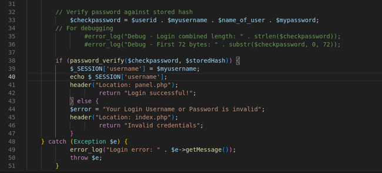
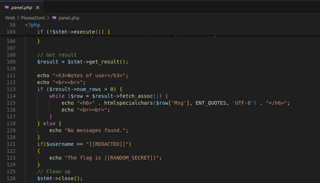
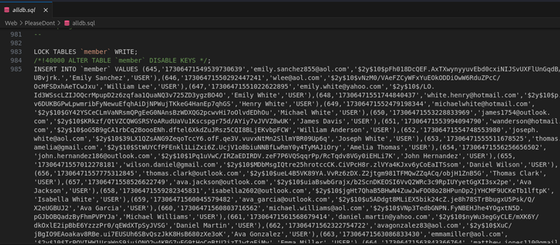
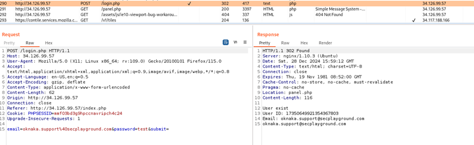
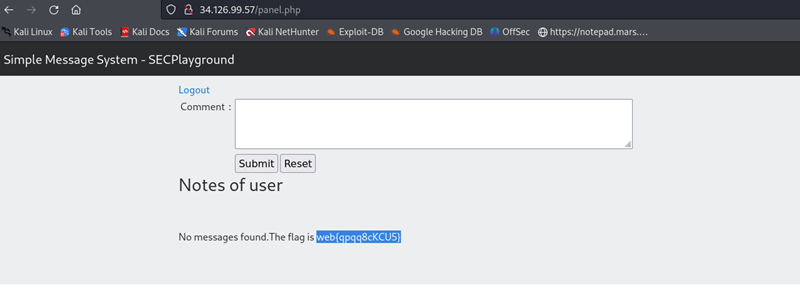

## ข้อ 6: Please don't

> 🏆 **Challenge**:   
> 💪 **Difficulty**:  🟠 MEDIUM  
> 🎯 **Category**: Web Application Security

## การวิเคราะห์โจทย์ 
เมื่อเริ่มต้นการสำรวจเว็บแอป เราพบไฟล์ **robots.txt** ซึ่งเป็นไฟล์ที่ทำหน้าที่บอกให้ search engine รู้ว่าไม่ควรเข้าไปใน path ไหน มันมีรายการ path ที่น่าสนใจคือ **/sourcecode.zip**!   

เมื่อเราทำการ **download** ไฟล์ **sourcecode.zip** มาแล้ว เปิดดูเนื้อใน ก็พบกับ **code** ที่มีความน่าสนใจหลายไฟล์ เช่น:  

- **login.php**: ในไฟล์นี้มีการเขียนโค้ดเกี่ยวกับการ **login** ซึ่งดูเหมือนว่าสามารถทำ **SQL Injection** ได้ ไม่ยากเลยที่จะลอง  

- **panel.php**: นี่คือไฟล์ที่แสดง **flag** โดยมีการกำหนด user ที่สามารถเห็นข้อมูลนั้นได้  

- **alldb.sql**: ไฟล์นี้มีข้อมูลของ user ทั้งหมดในระบบ ซึ่งเป็นข้อมูลสำคัญสำหรับการทำ **bruteforce**   

## ขั้นตอนการทดสอบและแก้โจทย์  
- เริ่มทดลองทำ **SQL Injection** ในหน้า **login.php** แต่ไม่เป็นผลสำเร็จ อาจเป็นเพราะถูกป้องกันด้วยฟังก์ชัน `mysqli_real_escape_string` ที่มีอยู่  

- จากนั้นเราจึงนำ **username** ทั้งหมดมาทำ **bruteforce login** ก็พบ username ที่สามารถเข้าสู่ระบบสำเร็จเยอะมาก! ในระหว่างที่กำลังดูระบบไปเรื่อยๆ ก็เจอ username ที่ทำให้ตาโตคือ `oknaka.support@secplayground.com` สุดยอด! แค่เห็นก็กระตุกหน่อยๆ เลยจับมาใส่หน้าล็อกอินเลยทันที แค่... ใส่ password ไปมั่วๆ แบบ 'เอาละ มาช่วยฉันเถอะนะ' ไม่หวังอะไรเลย พิมพ์ไปแบบขำๆ

 

- แล้ววุ้บ! หน้าจอกลับมา 'เข้าสู่ระบบสำเร็จ!' มาทำไมวะ!? คือแบบ ฮะ? เอ๊ะ! เกิดอะไรขึ้น!? ฟลุ๊คขนาดนี้ แอบคิดในใจ อาจจะเปิดช่องโหว่พาเข้าไปแบบนี้แน่เลย!"

- สุดท้าย เราก็สามารถเข้าถึง **panel.php** ได้ พร้อมพบ **flag** ของข้อนี้อยู่ที่นั่น!  

### ✅ บทสรุปจากโจทย์นี้   
ด้วยความมุ่งมั่นและความสามารถในการวิเคราะห์โค้ด ทำให้เราไขรหัสและค้นพบ flag ที่ซ่อนอยู่ได้สำเร็จ! แต่... จริงๆ แล้วมันไม่ใช่เลย เพราะทั้งหมดที่เกิดขึ้นเป็นแค่การเดาโชคดีแบบพลิกล็อกเข้าไปแบบไม่ตั้งใจ เอาเป็นว่า โชคช่วยจริงๆ ข้อนี้!  

---
###### Written by Kornpong.m
###### #SECPlayground   #SECPlaygroundBloodyXMas2024 

<a href="./"><<กลับหน้าหลัก</a>