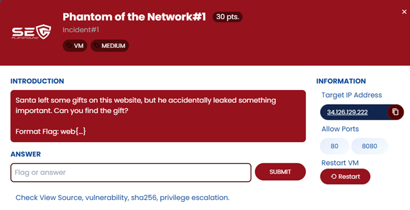
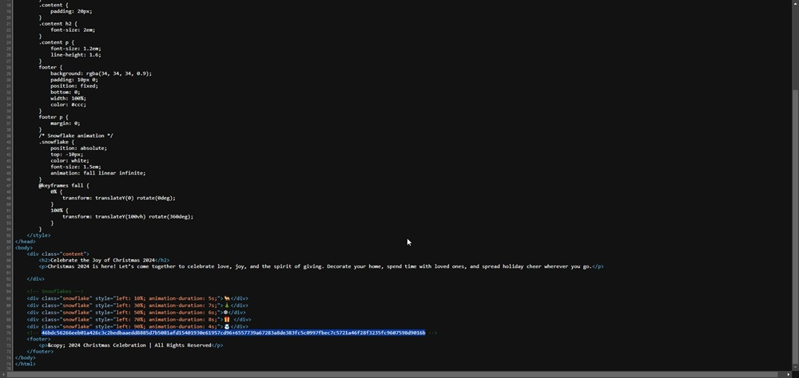
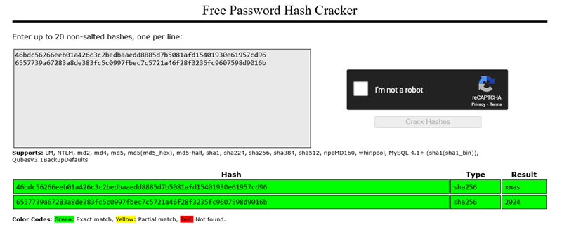
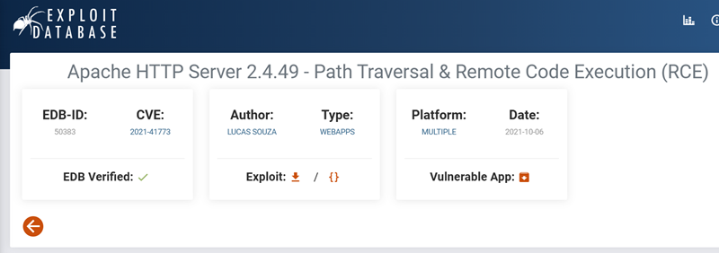
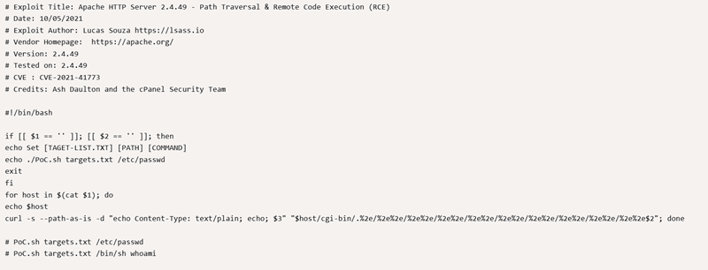
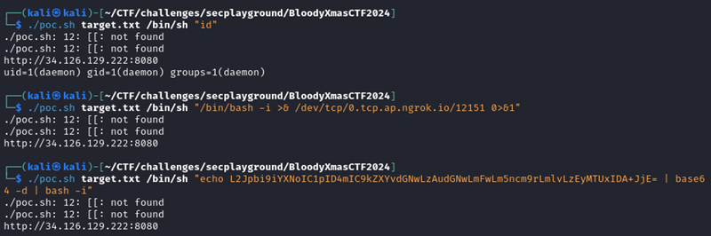
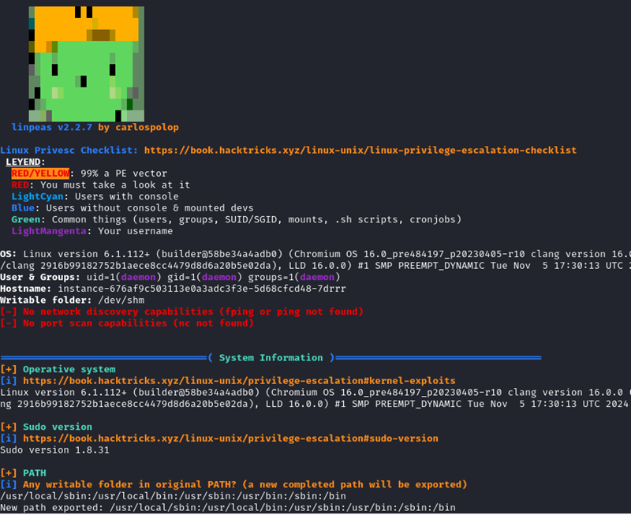
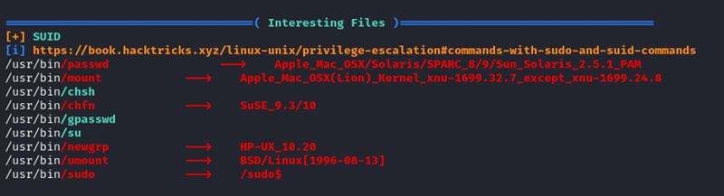

## ข้อ Phantom of the Network เป็นข้อ Web อีกข้อที่อยู่ในหมวด Incident ข้อแรก

> 🏆 **Challenge**:    
> 💪 **Difficulty**:  🟠 MEDIUM  
> 🎯 **Category**: Web Application Security

### **เริ่มการวิเคราะห์:**  
เมื่อทำการตรวจสอบ พบว่าข้อนี้มีการเปิดใช้งาน **2 พอร์ตสำคัญ:** 80 และ 8080 🔎  

#### **ปริศนาแรกบน Web Port 80**  
- บน Port นี้ มีข้อมูล **Hash** 2 ชุดที่สะดุดตา:  
  - `46bdc56266eeb01a426c3c2bedbaaedd8885d7b5081afd15401930e61957cd96`  
  - `6557739a67283a8de383fc5c0997fbec7c5721a46f28f3235fc9607598d9016b`  
  
  

- เมื่อทำการ **Decrypt** ได้คำว่า **'xmas'** และ **'2024'**! 🎄🎅  

#### **Port 8080 กับความลับที่ซ่อนอยู่**  
- พบว่ารัน **Apache HTTP Server 2.4.49** ซึ่งมี **CVE-2021-41773** (ช่องโหว่ Path Traversal & Remote Code Execution) 🛠️  
- เลือกใช้ **POC (Proof of Concept)** จาก **exploit-db** เพื่อเริ่มการโจมตี:  
  [https://www.exploit-db.com/exploits/50383](https://www.exploit-db.com/exploits/50383)  
  

---

### **ทำการ Run OS Command:**  
- เมื่อ Exploit สำเร็จ พบว่าไฟล์ Flag น่าจะซ่อนอยู่ที่ `/var/www/flag.txt` 📄✨  
- **แต่!!!** การเข้าถึงไฟล์นี้จำเป็นต้องมีสิทธิ์ **root** 💡  
- ต้องดำเนินการต่อโดยสร้าง **Reverse Shell** เพื่อยกระดับสิทธิ์

---

#### **ด่านถัดไป: การยกระดับสิทธิ์!**  
- ใช้ **linpeas.sh** ซึ่งเป็น **Linux Privilege Escalation Awesome Script**  
  สำหรับตรวจสอบแนวทางในการยกระดับสิทธิ์ 🔍  
  [https://github.com/peass-ng/PEASS-ng/tree/master/linPEAS](https://github.com/peass-ng/PEASS-ng/tree/master/linPEAS)  
  

- ทดสอบทุกวิธีที่ Script ชี้แนะ แต่...  

**ผลลัพธ์ที่ไม่คาดหวัง:**  

- **ไม่สามารถยกระดับสิทธิ์** และ **ไม่สามารถอ่าน Flag ได้!** 🚫🚩  

### **บทสรุปอันขมขื่น** 
 
แม้จะพยายามเต็มที่ แต่ก็ยังไม่สามารถไขปริศนาและห flag สำเร็จ  
**ความท้าทายนี้ยังคงต้องรอการไข!** 🧩⏳

---
<a href="./"><<กลับหน้าหลัก</a>