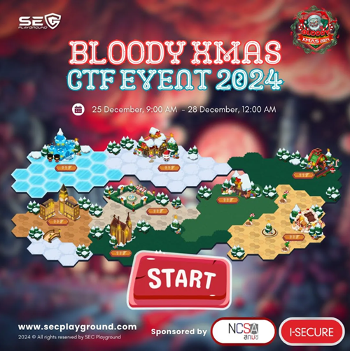
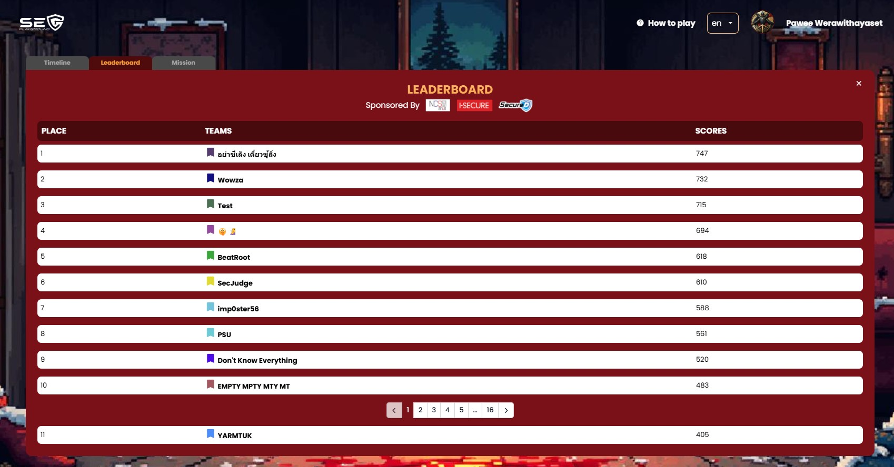

## SEC Playground Bloody Xmas 2024: ศึกดวลทักษะสาย Security ส่งท้ายปี! 🎯

สวัสดีชาว CTF ทุกคน! วันนี้จะมาแชร์ประสบการณ์สุดมันส์จากการแข่งขัน SEC Playground Bloody Xmas 2024 กับทีม **YARMTUK** ของเรา ต้องบอกเลยว่าการแข่งขันครั้งนี้เดือดมาก เราเลือกมาให้ 2 หมวดที่ถนัด
ด้วยความที่เป็นการแข่งขันช่วงคริสต์มาส แต่บรรยากาศร้อนฉ่าเหมือนอยู่ในสนามรบ! เราโฟกัสไปที่:

- **Web Application** สุดโหด ฝ่าด่านสำเร็จถึง 7 ข้อ ได้ลองทั้ง SQL injection และช่องโหว่สุดแปลกที่ไม่เคยเจอที่ไหนมาก่อน! 💪

- **Reverse Engineering** สายแกะโค้ด พลิกแพลง ทำไปได้ 5 ข้อ 🔍

มาติดตามกันว่าเราจะผ่านแต่ละด่านมาได้ยังไง เจอกับดักอะไรบ้าง และมีเทคนิคเด็ดๆ อะไรที่อยากแชร์ให้เพื่อนๆ ได้ลองเอาไปใช้กัน writeup นี้จะพาทุกคนดำดิ่งไปในโลกของ cybersecurity ! 🎄⚔️

---

### หมวด Web Application 

<table>
  <thead>
    <tr>
      <th>โจทย์</th>
      <th>ระดับ</th>
      <th>สถานะ</th>
    </tr>
  </thead>
  <tbody>
    <tr>
      <td><a href="./01_Bespoke_Library_Writeup">Bespoke Library</a></td>
      <td></td>
      <td></td>
    </tr>
    <tr>
      <td><a href="./02_Bespoke_Library2_Writeup.md">Bespoke Library2</a></td>
      <td></td>
      <td></td>
    </tr>
    <tr>
      <td><a href="./03_The_Naughty_List_Writeup.md">The Naughty List</a></td>
      <td></td>
      <td></td>
    </tr>
    <tr>
      <td><a href="./04_Santa_is_forgetful.md">Santa is forgetful!</a></td>
      <td></td>
      <td></td>
    </tr>
    <tr>
      <td><a href="./05_Merry_Christmas.md">Merry Christmas</a></td>
      <td></td>
      <td></td>
    </tr>
    <tr>
      <td><a href="./06_Please_don't.md">Please don't</a></td>
      <td></td>
      <td></td>
    </tr>
    <tr>
      <td><a href="./07_BookClub.md">BookClub</a></td>
      <td></td>
      <td></td>
    </tr>
    <tr>
      <td><a href="./08_Log_Christmas.md">Log Christmas</a></td>
      <td></td>
      <td></td>
    </tr>
    <tr>
      <td><a href="./09_Santa_Math.md">Santa's Math</a></td>
      <td></td>
      <td></td>
    </tr>
    <tr>
      <td><a href="./10_Phantom_of_the_Network1.md">Phantom of the Network#1</a></td>
      <td></td>
      <td></td>
    </tr>
  </tbody>
</table>

| โจทย์ | ระดับ |  |
|----------|----------|----------|
| [Bespoke Library](./01_Bespoke_Library_Writeup)  |   |    |   | 
| [Bespoke Library2](./02_Bespoke_Library2_Writeup.md)  |   |   |
| [The Naughty List](./03_The_Naughty_List_Writeup.md)  |   |    |  |
| [Santa is forgetful!](./04_Santa_is_forgetful.md)  |   |  |
| [Merry Christmas](./05_Merry_Christmas.md)  |   |  |
| [Please don't](./06_Please_don't.md)  |   |    |  |
| [BookClub](./07_BookClub.md)  |   |  |
| [Log Christmas](./08_Log_Christmas.md)  |   |  |
| [Santa's Math](./09_Santa_Math.md) |   |  |
| [Phantom of the Network#1](./10_Phantom_of_the_Network1.md) |   |    |  |

### หมวด Reverse Engineering 

| โจทย์ | ระดับ |  |
|----------|----------|----------|
| [Secplaysomware#1](./)  |    |   | 
| [Secplaysomware#2](./)  |    |   |
| [Secplaysomware#3](./)  |    |   |  
| [Secplaysomware#4](./)  |    |   |
| [Hello World](./)  |    |   |  
