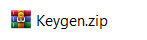
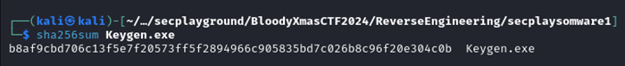
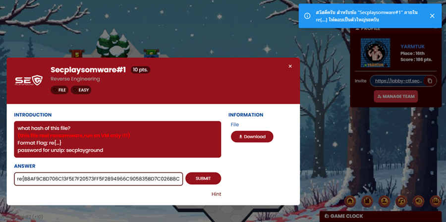
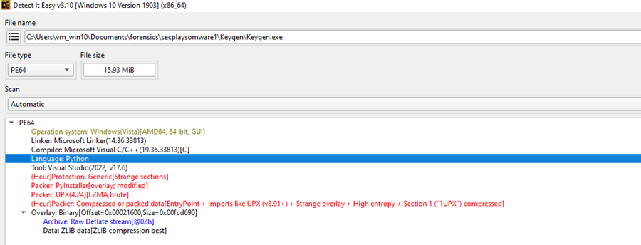
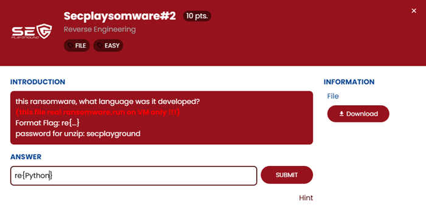
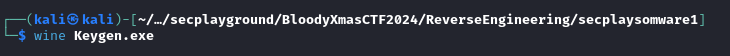
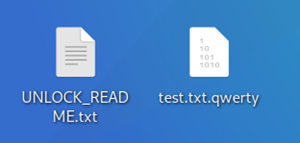
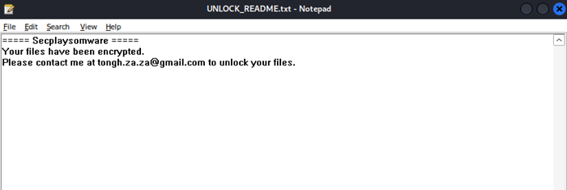
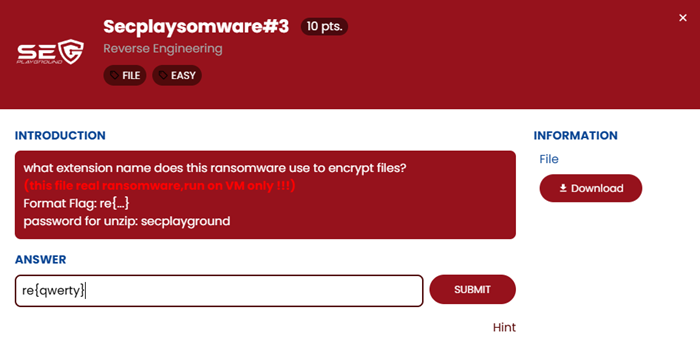
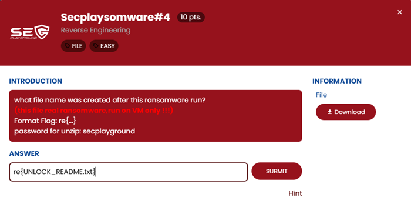

## ข้อ Secplaysomware #1-4

> 🏆 **Challenge**:   
> 💪 **Difficulty**:  🟢 EASY  
> 🎯 **Category**: Reverse Engineering

โจทย์มีไฟล์มาให้ เราจะต้องทำการวิเคราะห์ ไฟล์ชื่อ `Keygen.zip`  มาดูวิธีการแก้โจทย์ในแต่ละข้อกันเลย!



---

### **โจทย์ข้อที่ 1: ค่า hash ของไฟล์คืออะไร**
เราดาวน์โหลดไฟล์ `Keygen.zip` และแตกไฟล์ออกมา ซึ่งไฟล์ที่ได้คือ `Keygen.exe` จากนั้นเราก็ใช้คำสั่ง `sha256sum` ใน Linux เพื่อหาค่า hash ของไฟล์นี้

```bash
sha256sum Keygen.exe
```


ตอบยังไงก็ผิดเพราะตัวอักษรตัวพิมพ์เล็ก จนมีข้อความจากระบบว่าต้องเป็นตัวพิมพ์ใหญ่

**คำตอบ**: (ค่า hash ที่ได้จากคำสั่ง sha256sum) 



---

### **โจทย์ข้อที่ 2: โปรแกรม virus นี้เขียนด้วยภาษาอะไร**
ในการหาคำตอบนี้ เราใช้โปรแกรม **Detect It Easy (DIE)** เพื่อวิเคราะห์ไฟล์ `Keygen.exe` และรู้ว่าโปรแกรมไวรัสนี้ถูกเขียนด้วย **Python**



**คำตอบ**: Python


---

### **โจทย์ข้อที่ 3: ไฟล์ที่ถูกเข้ารหัสด้วย virus นี้ นามสกุลไฟล์คืออะไร**
เราใช้ **Wine** ซึ่งเป็น tool สำหรับ run exe ใน Kali Linux เพื่อลองรันโปรแกรมนี้ดู ผลปรากฏว่าสามารถรันโปรแกรมไวรัสนี้ได้มี Popup ขึ้นมา และไฟล์สองไฟล์ถูกสร้างขึ้นที่หน้า Desktop ได้แก่:
  - `UNLOCK_README.txt`
  - `test.txt.qwerty`





ดังนั้น คำตอบของโจทย์นี้คือไฟล์ที่ถูกเข้ารหัสมีนามสกุลว่า **.qwerty**

**คำตอบ**: qwerty



---

### **โจทย์ข้อที่ 4: ไฟล์ที่ถูกสร้างขึ้น คือไฟล์อะไร**
เมื่อรันโปรแกรมไวรัส พบว่าไฟล์ที่ถูกสร้างคือ `UNLOCK_README.txt`

**คำตอบ**: UNLOCK_README.txt


---

## สรุปคำตอบ:
1. **ค่า hash ของไฟล์**: (ค่า hash ที่ได้จากคำสั่ง sha256sum) อย่าลืมเปลี่ยนเป็นตัวพิมพ์ใหญ่
2. **ภาษาเขียนของไวรัส**: Python
3. **นามสกุลไฟล์ที่ถูกเข้ารหัส**: qwerty
4. **ไฟล์ที่ถูกสร้าง**: UNLOCK_README.txt

---