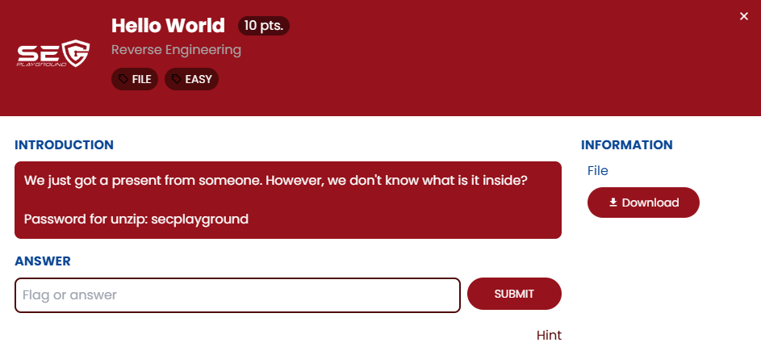
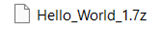
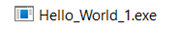
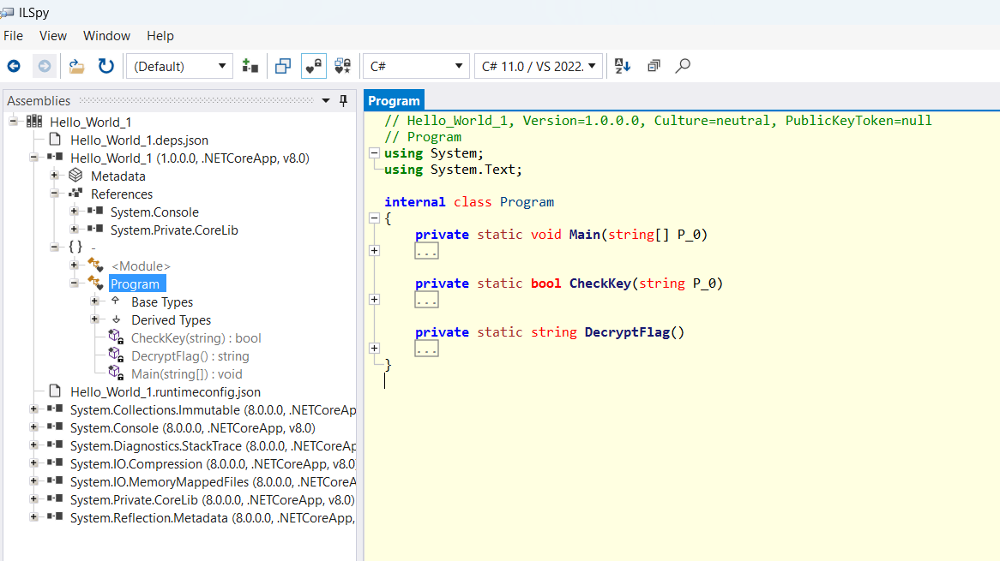
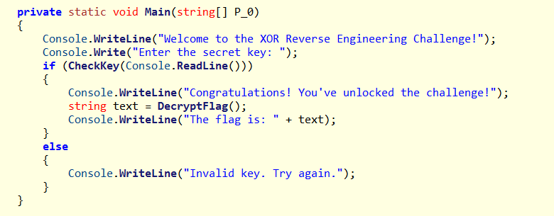
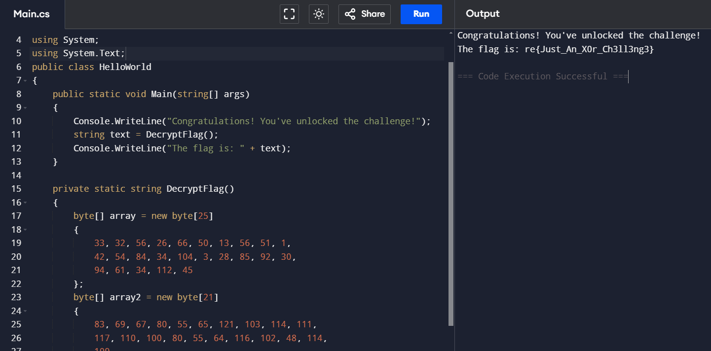

## ข้อ Hello World 

> 🏆 **Challenge**:   
> 💪 **Difficulty**:  🟢 EASY  
> 🎯 **Category**: Reverse Engineering

โจทย์มีไฟล์มาให้ เราจะต้องทำการวิเคราะห์ ไฟล์ชื่อ `Hello_World_1.7z`  
เมื่อทำการแตกไฟล์ออกมา ก็จะได้ไฟล์ `Hello_World_1.exe`

## Reverse Engineering ด้วย ILSpy

เราทำการเปิดไฟล์ **Hello_World_1.exe** ด้วยโปรแกรม **ILSpy** ซึ่งเป็นเครื่องมือที่มีประโยชน์สำหรับการ reverse โปรแกรม .NET เพื่อศึกษาฟังก์ชันภายในโปรแกรม  

หลังจากเปิดโปรแกรม, สิ่งที่พบคือมีฟังก์ชันหลักที่น่าสนใจดังนี้:

- **Main**
- **CheckKey**
- **DecryptFlag**

## ฟังก์ชันการทำงานของโปรแกรม

โปรแกรมจะทำงานตาม flow ดังนี้:

1. โปรแกรมจะรอรับ **secret key** จากผู้ใช้
2. secret key ที่ผู้ใช้ป้อนจะถูกส่งเข้าไปยังฟังก์ชัน **CheckKey** เพื่อทำการตรวจสอบ
3. หาก **CheckKey** ยืนยันว่า key ถูกต้อง, ฟังก์ชัน **DecryptFlag** จะถูกเรียกใช้งานเพื่อ **print flag** ที่ซ่อนอยู่

## การหา Flag

เราทราบแล้วว่าฟังก์ชัน **DecryptFlag** จะทำการแสดงผล **flag** เมื่อมีการป้อน secret key ที่ถูกต้อง  
และด้วยความตั้งใจอันแน่วแน่, เราไม่ต้องรอ!  

เราได้ **copy code** จากฟังก์ชัน **DecryptFlag** แล้ว **run** มันใน online-compiler เพื่อลดเวลาในการลองผิดลองถูก!

## ผลลัพธ์

สุดท้าย... BAM! ได้ flag แบบไม่ต้องคิดมาก 🔥

---
###### #SECPlayground   #SECPlaygroundBloodyXMas2024 

<a href="./"><<กลับหน้าหลัก</a>  

